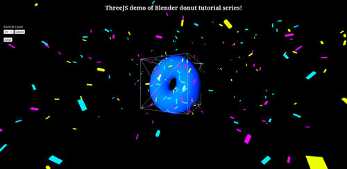

A threeJS project I made for practicing threeJS.

Consumes ~100mb of ram and <1% of a Ryzen 7 5800H.

Compiled with a very low mesh donut made with Blender 3D.

If you want to test it out, clone this repostory, then run

`npm install`

`npm run dev`

It will create a web on port 3000 and expose it to the network. Adjust the vite.config.js file if needed.